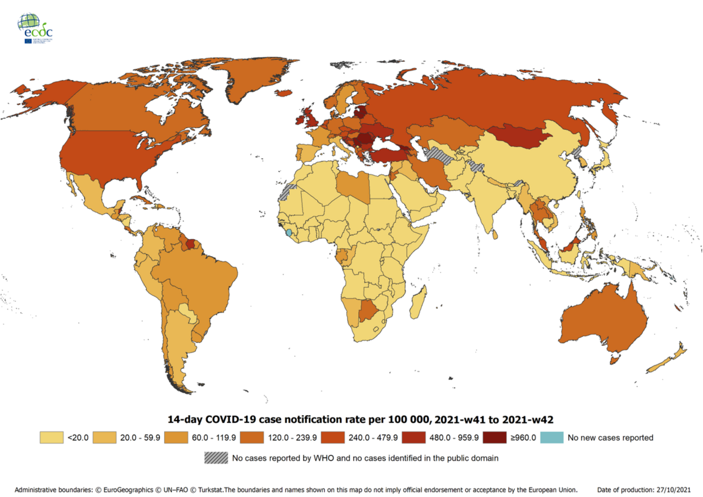
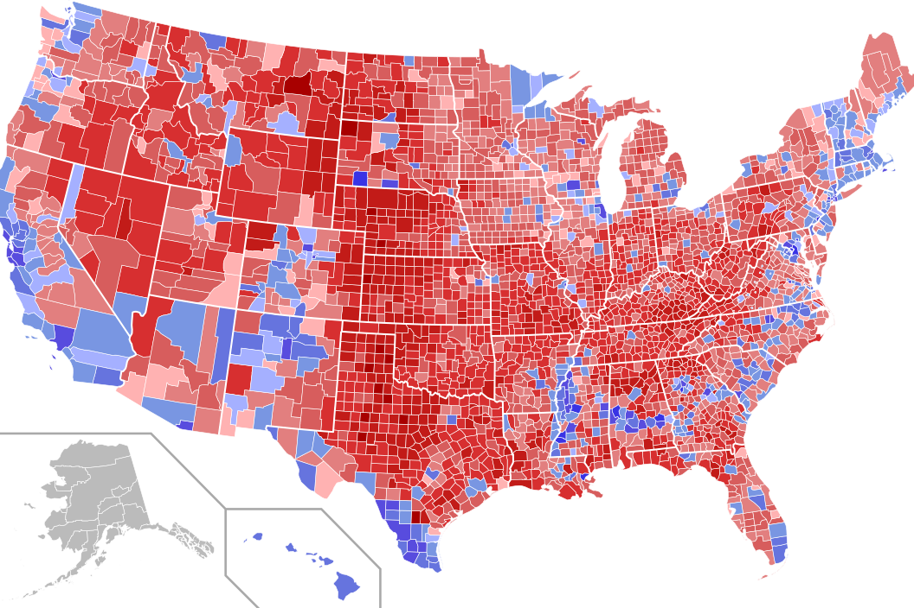
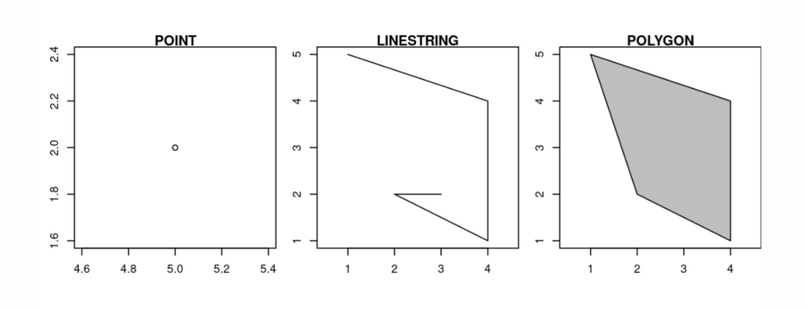

```{r setup, include=FALSE}
options(htmltools.dir.version = FALSE)
library(knitr)
opts_chunk$set(
  prompt = T,
  fig.width=15, fig.height=4, 
  # out.width="748px", #out.length="520.75px",
  dpi=300, #fig.path='Figs/',
  cache=F, #echo=F, warning=F, message=F
  engine.opts = list(bash = "-l")
  )

knit_hooks$set(
  prompt = function(before, options, envir) {
    options(
      prompt = if (options$engine %in% c('sh','bash')) '$ ' else 'R> ',
      continue = if (options$engine %in% c('sh','bash')) '$ ' else '+ '
      )
})

library(sf)
library(tidyverse)
library(xaringanBuilder)
library(leaflet)
library(tmap)
library(tmaptools)
```


# Structure

--

1. [What is geocoding?](#definition)

--

2. [Data requirements](#requirements)

--

3. [The **s**imple **f**eatures package in R](#package)

--

4. [What can sf do?](#ability)

--

5. [How do sf and geocoding interact](howto)

--

6. [A practical application](#application)


---
class: inverse, center, middle
name: definition

# What is geocoding?

---
# What is geocoding?

--

- Turning (text-based) addresses or locations into geographic positions

--

- Location of the Hertie School (Friedrichsstraße 180, 10117 Berlin) -> 52.512963808601505, 13.389202140609111

--

- In a broader sense, geocoding is one central aspect of working with spatial data 

--

- Once the data of interested is geocoded, it can be used for further spatial analysis

--

- You will see some examples at the end of the presentation and in the live coding part!

<br>
<div align = "center">


---

# What is geocoding?

--

- The geographic position is commonly expressed in **latitude** and **longitude**

--

  - Latitude refers to the north-south position of a point 

  - Longitude refers to the east-west position of a point
  
--

- **Reverse-geocoding** takes given coordinates and translates them into an address

--

- Both types of geocoding are helpful whenever **location** is at the center of attention: 

  - Where do legislators have their offices?
  
  - Where do conservative voters live? 
  
  - Are there geographical patterns in the development of COVID-19 spread?


---

# A practical example

<div align="center">


Source: https://www.ecdc.europa.eu/en/geographical-distribution-2019-ncov-cases

---

# ... and another one 

<div align="center">


Source: https://source.wustl.edu/2020/02/the-divide-between-us-urban-rural-political-differences-rooted-in-geography/

---
class: inverse, center, middle
name: requirements

# Data requirements

---
# Data requirements

--

- Before starting with the substantial analysis, input data needs to be read into R

--

- Geocoding analysis distinguishes between two main input data types: **Relative** and **absolute** input data 

--

- Relative input data refers to **descriptions** of locations and cannot directly be translated into precise geographic data points

  - Instead, reference locations whose coordinates are known are used for approximation
  
--
  
- Absolute input data refers to data that can be directly translated into coordinates

  - Postal addresses and ZIP codes, cities, places
  
--
  
- Unsurprisingly, the latter data format is usually desired due to a more intuitive use and higher precision

--

- If we want to plot a geographical data point on a map, we need another data input: **shapefiles**

---
class: inverse, center, middle
name: package

# The **s**imple **f**eatures package in R 

---
# The **s**imple **f**eatures package in R

--

- Simple features is not limited to the package in R, but rather is a formal standard describing the geographic representation of real-world objects in computers 

--

- A **feature** commonly relates to such real-world objects, e.g. a street, a city, or a building

--

- These are represented by several simple features types (17 in total), most commonly points, linestrings, and polygons

--



--

- The sf package in R provides access to the simple feature standard and reformats geocoded data into the different sf types

--

- It offers multiple functions that are beneficial for working with geodata

  - Calculating surface area or distance, identifying whether a point lays in a given area, creating a point at the centre of an area


---
class: inverse, center, middle
name: ability

# What can sf do?

---
#What can sf do?

sf's functions can be broadly split up into five sections: 

--

- **Geometric confirmation**

  - Are point x and y the same (`st_equals`)? Does point x lie in a given area/polygon (`st_contains`)?

--

- **Geometric operation**

  - Creating a point that lies in the center of a given area/polygon (`st_centroid`)
  
--

- **Geometry creation**

  - Create a (triangular) polygon made from given points (`st_triangulate`)
  
--

- **Geometry operations**

  - Create a geometry that contains the shared area of two given areas (`st_intersect`) 
  
--

- **Geometric measurement**

  - Calculating the distance between points/areas (`st_distance`)

---
class: inverse, center, middle
name: howto

# How do sf and geocoding interact?

---
#How do sf and geocoding interact?

--

- Read in the **input data** (for example, your address or the postal code of your home town)

--

- For this purpose, numerous sources as the *Open Street Map* or the Google Maps API can be used

--

- The build-in `st_read`-command enables users to read in existing geocoded datasets and converts them to sf objects

--

- Geocoded data that is in sf format can then be mapped, e.g. one could map a point on a given area

--

**Important**: In case that the geocoded data comes from different sources (e.g. a shapefile and a list of addresses), make sure to use the same coordinate reference system code by specifying the **CRS argument**!

<div align="center">
<br>


---
class: inverse, center, middle
name: application

# A practical application

---
#A practical application

**Geocoding the Hertie School's address with the `geocode_OSM` function frome the `tmap`-library**
```{r}
hertie <- ("Friedrichsstraße 180, 10117 Berlin")
hertie_geocoded <- geocode_OSM(hertie, as.data.frame = T)
```

--

**Preparing the shapefile containing information about Berlin's borders and further vector features**
```{r}
unzip("bezirksgrenzen.shp.zip", 
      exdir = "berlin_zip_shapefile", junkpaths = TRUE, 
      overwrite = TRUE)
```

---
#A practical application#

**Transforming both the shapefile and the geocoded address to sf objects and joining them**
```{r}
berlin <- st_read("berlin_zip_shapefile//bezirksgrenzen.shp")
hertie_point <- st_as_sf(hertie_geocoded, coords = c(x = "lon", y = "lat"), crs = 4326)

hertie_on_a_map <- st_join(hertie_point, berlin, join = st_within)
```

---
#A practical application

**Plotting a map of Berlin including the location of Hertie School**
```{r}
tm_shape(berlin) +
tm_fill() +
tm_shape(hertie_on_a_map) +
tm_bubbles(col = "blue", size = 0.1)
```
